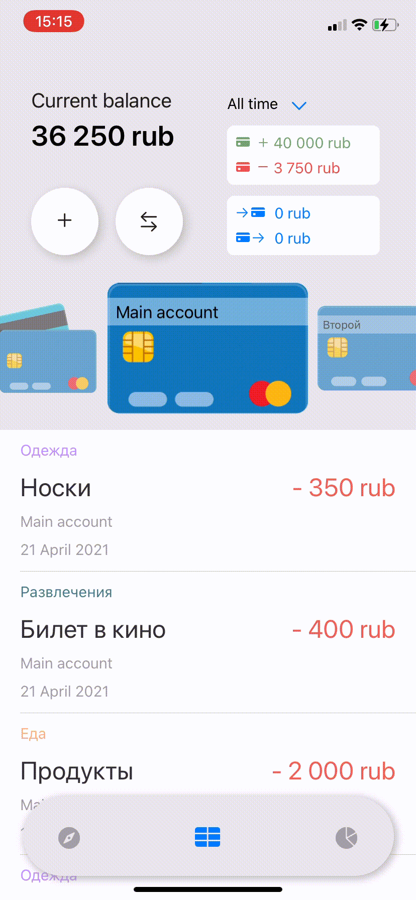

# FinanceApp | *Приложение для контроля финансов* 

FinanceApp - это приложение, с помощью которого можно вести учет трат и доходов, а также переводов между своими счетами.

<table>
  <tr>
    <th></th>
    <th></th>
    <th></th>
    <th></th>
  </tr>
</table>

## Особенности
- Три вкладки: таблица, диаграммы и обменные курсы валют
- - В таблице можно добавлять, редактировать и удалять траты/доходы, а также совершать переводы. Кнопка перевода не активна, если в базе хранится только один счет
- - Диаграммы строятся по данным из таблицы: их можно фильтровать по периодам и счетам
- - В третьей вкладке подгружаются данные с открытых API по текущему курсу валют и криптовалют
- Можно добавлять новые категории и аккаунты

## Технологии
FinanceApp использует:
- Swift 5, Xcode 11
- Realm.io - объектно-ориентированная база данных
- Cocoapods.org - для подключения сторонних библиотек
- - Alamofire и SwiftyJSON - для работы с API и JSON-форматом
- - FSPagerView - для плавного скроллинга
- - Charts - для построения круговой диаграммы
- - IQKeyboardManagerSwift - для более удобного взаимодействия с клавиатурой
- - ColorPickTip - выбор цвета для категорий
- API
- - CurrencyScoop
- - CoinAPI

#### Перед использованием замените API-ключи на свои.

## Лицензия
Только для ознакомления.
2021

